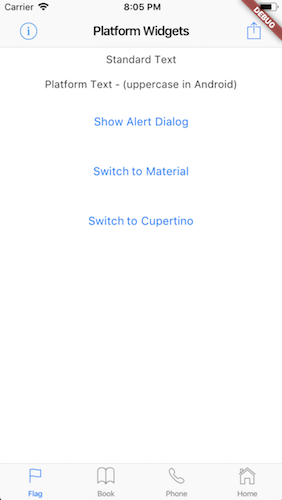
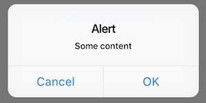

# Flutter Platform Widgets

This project is an attempt to see if it is possible to create widgets that are platform aware. Currently in order to render targeted Android or iOS device specific styles, you need to either conditionaly check the platform or create a set of widgets to render differently depending on the running platform.

This package only supports at most the Beta release. Dev or Master channels are not supprted.

# Installation

> Pubspec: https://pub.dev/packages/flutter_platform_widgets

# Widgets

These set of widgets allow for rendering based on the target platform using a single cross platform set of widget.




Each `PlatformWidget` provides common properties directly as constructor arguments. If required further customization can be achieved by using the platform widget builder. See the **Enhance** section of each widget.

- [PlatformWidget](https://github.com/aqwert/flutter_platform_widgets/blob/master/README.md#platformwidget)
- [PlatformText](https://github.com/aqwert/flutter_platform_widgets/blob/master/README.md#platformtext)
- [PlatformSwitch](https://github.com/aqwert/flutter_platform_widgets/blob/master/README.md#platformswitch)
- [PlatformSlider](https://github.com/aqwert/flutter_platform_widgets/blob/master/README.md#platformslider)
- [PlatformTextField](https://github.com/aqwert/flutter_platform_widgets/blob/master/README.md#platformtextfield)
- [PlatformButton](https://github.com/aqwert/flutter_platform_widgets/blob/master/README.md#platformbutton)
- [PlatformIconButton](https://github.com/aqwert/flutter_platform_widgets/blob/master/README.md#platformiconbutton)
- [PlatformApp](https://github.com/aqwert/flutter_platform_widgets/blob/master/README.md#platformapp)
- [PlatformScaffold](https://github.com/aqwert/flutter_platform_widgets/blob/master/README.md#platformscaffold)
- [PlatformAppBar](https://github.com/aqwert/flutter_platform_widgets/blob/master/README.md#platformappbar)
- [PlatformNavBar](https://github.com/aqwert/flutter_platform_widgets/blob/master/README.md#platformnavbar)
- [PlatformAlertDialog](https://github.com/aqwert/flutter_platform_widgets/blob/master/README.md#platformalertdialog)
- [PlatformDialogAction](https://github.com/aqwert/flutter_platform_widgets/blob/master/README.md#platformdialogaction)
- [PlatformCircularProgressIndicator](https://github.com/aqwert/flutter_platform_widgets/blob/master/README.md#platformcircularprogressindicator)
- [PlatformPageRoute](https://github.com/aqwert/flutter_platform_widgets/blob/master/README.md#platformpageroute)
- [PlatformProvider](https://github.com/aqwert/flutter_platform_widgets/blob/master/README.md#platformprovider)

## PlatformWidget

A widget that will render either the android widget or cupertino widget based on the target platform. The widgets themselves do not need to be specifically Material or Cupertino.

```dart
return PlatformWidget(
  ios: (_) => Icon(CupertinoIcons.flag),
  android: (_) => Icon(Icons.flag),
);
```

## PlatformText

A widget that will render uppercase for Android. iOS will remain unchanged.

```dart
return PlatformText('Cancel');
```

## PlatformSwitch

A switch widget that will use a `Switch` for android or a `CupertinoSwitch` for iOS.

```dart
return PlatformSwitch(
  onChanged: (bool value) {},
  value: value,
);
```

#### Enhance

```dart
return PlatformSwitch(
  onChanged: (bool value) {},
  value: value,
  android: (_) => MaterialSwitchData(...),
  ios: (_) => CupertinoSwitchData(...)
);
```

## PlatformSlider

A slider widget that will use a `Slider` for android or a `CupertinoSlider` for iOS

```dart
return PlatformSlider(
  onChanged: (bool value) {},
  value: value,
);
```

#### Enhance

```dart
return PlatformSlider(
  onChanged: (bool value) {},
  value: value,
  android: (_) => MaterialSliderData(...),
  ios: (_) => CupertinoSliderData(...)
);
```

## PlatformTextField

A text field widget that will use a `TextField` for android or a `CupertinoTextField` for iOS.

```dart
return PlatformTextField();
```

#### Enhance

```dart
return PlatformTextField(
  android: (_) => MaterialTextFieldData(...),
  ios: (_) => CupertinoTextFieldData(...)
);
```

## PlatformButton

A button that will render a `RaisedButton` or `FlatButton` for android or a `CupertinoButton` for iOS.

```dart
return PlatformButton(
  onPressed: () => print('send'),
  child: PlatformText('Send'),
);
```

#### Enhance

Extend with `WidgetBuilder` for android or iOS.

```dart
return PlatformButton(
  onPressed: () => print('send'),
  child: PlatformText('Send'),
  android: (_) => MaterialRaisedButtonData(...),
  ios: (_) => CupertinoButtonData(...)
);
```

> Note: For android you can use the `FlatButton` instead. To do this use the `MaterialFlatButtonData` on the `androidFlat` argument.

```dart
return PlatformButton(
 onPressed: () => print('send'),
 child: PlatformText('Send'),
 androidFlat: (_) => MaterialFlatButtonData()
);
```

## PlatformIconButton

A clickable (tappable) button with an icon. Uses `IconButton` for android or `CupertinoButton` for iOS.

```dart
return PlatformIconButton(
  onPressed: () => print('info pressed'),
  iosIcon: Icon(
    CupertinoIcons.info,
    size: 28.0,
  ),
  androidIcon: Icon(Icons.info)
);
```

#### Enhance

Extend with `WidgetBuilder` for android or iOS.

```dart
Widget infoIconButton() {
  return PlatformIconButton(
    onPressed: () => print('info pressed'),
    iosIcon: Icon(CupertinoIcons.info),
    androidIcon: Icon(Icons.info),
    android: (_) => MaterialIconButtonData(...),
    ios: (_) => CupertinoIconButtonData(...),
  );
}
```

## PlatformApp

A top level widget for the applciation that uses `MaterialApp` for android or `CupertinoApp` for iOS.

```dart
return PlatformApp(
  title: 'Flutter Demo',
  home: ...
);
```

#### Enhance

Extend with `WidgetBuilder` for android or iOS.

```dart
return PlatformApp(
  home:  ...
  android: (_) => MaterialAppData(...)
  ios: (_) => CupertinoAppData(...)
);
```

## PlatformScaffold

A Scaffold that provides the correctly hosted header (AppBar) and navigation bar (Bottom Bar) for each platform. Uses `Scaffold` for android or `CupertinoTabScaffold` for iOS with bottom tabs or `CupertinoPageScaffold` for iOS without bottom tabs.

```dart
return PlatformScaffold(
  appBar: PlatformAppBar()
  body: _buildContent(),
  bottomNavBar: PlatformNavBar(),
  iosContentPadding: false,
  iosContentBottomPadding: false
);
```

> Note that the use of `iosContentPadding = true` is only required if the content is being obstruced behind the appBar. `iosContentBottomPadding` is used if the content needs to be above the navBar and not go behind it

#### Enhance

Extend with `WidgetBuilder` for android or iOS.

```dart
return PlatformScaffold(
  appBar: PlatformAppBar()
  body: _buildContent(),
  bottomNavBar: PlatformNavBar(),
  android: (_) => MaterialScaffoldData(...)
  ios: (_) => CupertinoScaffoldData(...);
);
```

> Both the android and iOS builders are optional. If not provided the `Container` placeholder widget will be returned.

## PlatformAppBar

The AppBar is the top Header bar with a title, leftside or rightside buttons. Uses `AppBar` for android or `CupertinoNavigationBar` for iOS.

```dart
return PlatformAppBar(
    title: new Text('Platform Widgets'),
    leading: PlatformIconButton()),
    trailingActions: <Widget>[
      PlatformIconButton(),
    ],
  );
```

> In iOS if a solid color header is required and there is a ListView
> on the page, you would need to add some alpha to the color so that the
> ListView is not pushed down too far

```
     appBar: PlatformAppBar(
       title: Text('iOS Colored Header'),
       ios: (_) => CupertinoNavigationBarData(
             // Issue with cupertino where a bar with no transparency
             // will push the list down. Adding some alpha value fixes it (in a hacky way)
             backgroundColor: Colors.lightGreen.withAlpha(254),
           ),
     ),
```

#### Enhance

Extend with `WidgetBuilder` for android or iOS.

```dart
return PlatformAppBar(
  title: new Text('Platform Widgets'),
  leading: PlatformIconButton()),
  trailingActions: <Widget>[
    PlatformIconButton(),
  ],
  android: (_) => MaterialAppBarData(...),
  ios: (_)=> CupertinoNavigationBarData(...),
);
```

## PlatformNavBar

> Note: hasNotch has been removed to allow for the widget to work with the change on the development branch of flutter. To work around the breaking change either use the Material `BottomAppBar` directly or cast the result from PlatformNavBar to `BottomAppBar` for android builds and set the `hasNotch` property. Otherwise target version 0.2.0

The NavBar is placed at the bottom of the page with a set of buttons that typically navigate between screens. Implementing this widget requires the parent widget to manage the `currentIndex` of the page and to set `PlatformNavBar.currrentIndex`. Uses `BottomAppBar` with `BottomNavigationBar` for android or `CupertinoTabBar` for iOS.

```dart
return PlatformNavBar(
  currentIndex: _selectedTabIndex,
  itemChanged: (index) => setState(
        () {
          _selectedTabIndex = index;
        },
      ),
  items: [
    BottomNavigationBarItem(),
    BottomNavigationBarItem(),
  ],
);
```

#### Enhance

Extend with `WidgetBuilder` for android or iOS.

```dart
return PlatformNavBar(
  currentIndex: _selectedTabIndex,
  itemChanged: (index) => setState(
        () {
          _selectedTabIndex = index;
        },
      ),
  items: [
    BottomNavigationBarItem(),
    BottomNavigationBarItem(),
  ],
  android: (_) => MaterialNavBarData(...),
  ios: (_) => CupertinoTabBarData(...),
);
```

## PlatformAlertDialog

The AlertDialog will render a caption/title, body/text and a set of action buttons specific for the platform. Uses `AlertDialog` for android or `CupertinoAlertDialog` for iOS.

> Note use `showPlatformDialog` instead of either `showDialog` from the Material library or `showCupertinoDialog` from the Cupertino library.




```dart
showPlatformDialog(
  context: context,
  builder: (_) => PlatformAlertDialog(
    title: Text('Alert'),
    content: Text('Some content'),
    actions: <Widget>[
      PlatformDialogAction(),
      PlatformDialogAction(),
    ],
  ),
);
```

#### Enhance

Extend with `WidgetBuilder` for android or iOS.

```dart
showDialog(
  context: context,
  builder: (_) => PlatformAlertDialog(...),
  ios: (_) => CupertinoAlertDialogData(...),
  android: (_) => MaterialAlertDialogData(...),
)
```

## PlatformDialogAction

The DialogAction widget is used to describe the set of buttons on the AlertDialog. Uses `FlatButton` for android or `CupertinoDialogAction` for iOS.

```dart
PlatformDialogAction(
  child: PlatformText('Cancel'),
  onPressed: () => Navigator.pop(context),
),
```

#### Enhance

Extend with `WidgetBuilder` for android or iOS.

```dart
PlatformDialogAction(
  child: PlatformText('Cancel'),
  onPressed: () => Navigator.pop(context),
  android: (_) => MaterialDialogActionData(...),
  ios: (_) => CupertinoDialogActionData(...),
),
```

## PlatformCircularProgressIndicator

A circular looking progress indicator. Uses `CircularProgressIndicator` for android or `CupertinoActivityIndicator` for iOS.

```dart
return PlatformCircularProgressIndicator();
```

#### Enhance

Extend with `WidgetBuilder` for android or iOS.

```dart
return PlatformCircularProgressIndicator(
  android: (_) => MaterialProgressIndicatorData(...),
  ios: (_)=> CupertinoProgressIndicatorData(...),
);
```

## PlatformPageRoute

This function can be used within the `Navigator` to push either the `MaterialPageRoute` for android or `CupertinoPageRoute` for iOS.

```dart
  Navigator.push(
    context,
    platformPageRoute(
      builder: pageToDisplayBuilder,
    ),
  );
```

## PlatformProvider

A Provider that provides access to the functions of swicthing platforms which can be accessed from any screen.

Requires to be placed at the root (above MaterialApp, CupertinoApp or PlatformApp).

```dart
  return PlatformProvider(
    builder: (BuildContext context) MaterialApp(...)
  );
```

And to switch platforms...

```
PlatformProvider.of(context).changeToMaterialPlatform();
```

or

```
PlatformProvider.of(context).changeToCupertinoPlatform();
```

# TODO

- UI / Unit Tests.
- Code documentation

# Changing / Checking Platform

When importing `flutter_platform_widgets` you can check `isMaterial` or `isCupertino` to determine what style will be used. This is independent to `Platform.isAndroid` or `Platform.isIOS` from `'import 'dart:io'`

See the example code for how this is used.

# Issues and Feedback

Please [create](https://github.com/aqwert/flutter_platform_widgets/issues/new) an issue to provide feedback or an issue.

# Acknowledgements

Inspired by the example given by Swav Kulinski (https://github.com/swavkulinski/flutter-platform-specific-widgets)
